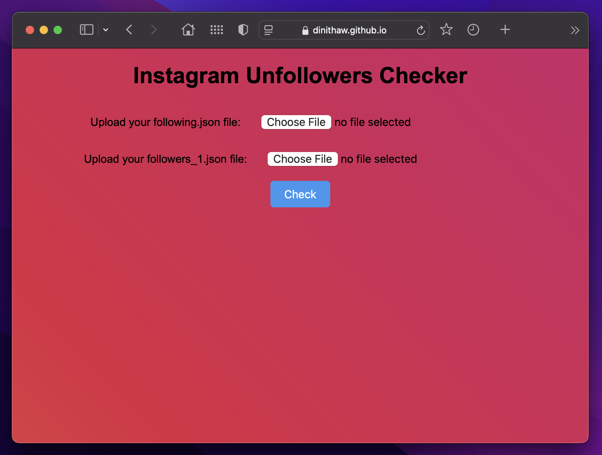

# Instagram Unfollowers Checker

This project helps you find out who doesn't follow you back on Instagram by comparing your list of followers with the list of people you are following.

## Features

- Upload JSON files containing your Instagram followers and following lists.
- Identify users who do not follow you back.
- Display the list of unfollowers in a user-friendly interface.

#### How to Download Your Instagram Data

1. Open Instagram on your web browser and log in to your account.
2. Go to your profile by clicking on your profile picture in the top right corner.
3. Click on the gear icon (Settings) next to the "Edit Profile" button.
4. Select "Privacy and Security" from the menu.
5. Scroll down to the "Data Download" section and click on "Request Download".
6. Enter your email address and select "JSON" as the format.
7. Click "Next" and enter your Instagram password.
8. Click "Request Download".
9. You will receive an email from Instagram with a link to download your data. Click on the link and download the ZIP file.
10. Extract the ZIP file to find the `followers_1.json` and `following.json` files.

### Prerequisites

To use this project, you need:

- A web browser (Chrome, Firefox, Safari, etc.)
- JSON files containing your Instagram followers and following lists. You can obtain these files by requesting your data from Instagram.